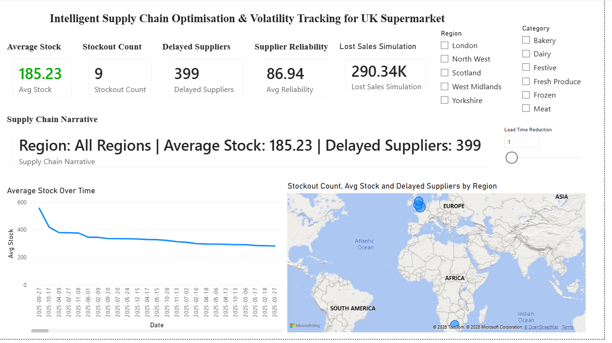

# Intelligent Supply Chain Optimisation & Volatility Tracking for UK Supermarkets

## Project Overview

This project implements an end-to-end supply chain analytics solution using:

- Python
- SQL
- Power BI

The objective is to detect inventory anomalies, measure supplier reliability, identify supply chain risks, and provide prescriptive analytics through an interactive Power BI dashboard.

---

## Phase 1 - Python Data Engineering

### Features

- CSV ingestion
- Data type standardization
- Intelligent anomaly detection
- Supplier Reliability Score
- Demand Volatility Index
- Database loading

---

## Phase 2 - SQL Analytics

### Business Problems Solved

1. Chronic Under-Delivery Detection
2. Perfect Storm Vulnerability Analysis
3. Supplier Impact Stress Test
4. False Alarm Audit

---

## Phase 3 - Power BI Dashboard

### Features

- Star Schema Data Model
- Executive KPI Dashboard
- Dynamic Narrative Generation
- UK Regional Supply Chain Map
- Lead Time What-If Simulation
- Lost Sales Prediction

---

## Dashboard Preview

